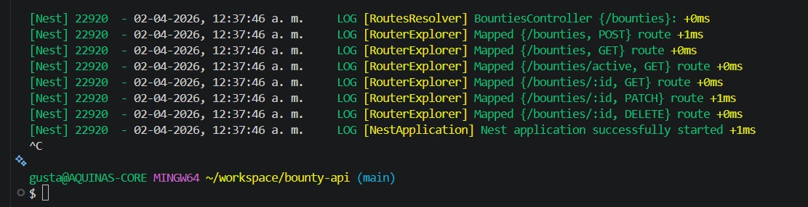
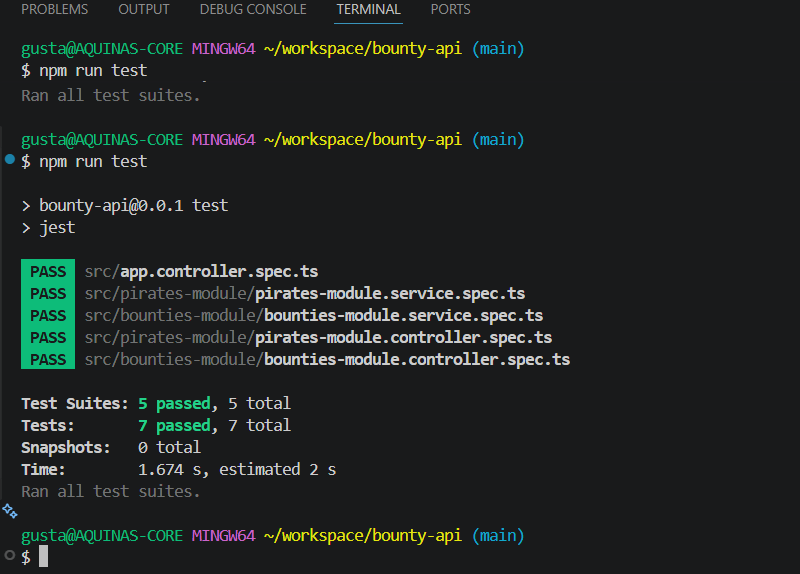

# 🏴‍☠️ Bounty API

API backend desarrollada con **NestJS**, **MongoDB Atlas** y **Mongoose** para gestionar piratas y sus recompensas dentro del sistema de búsqueda de la Marina.

## 📌 Descripción

Este proyecto permite:

- Registrar piratas
- Registrar recompensas asociadas a un pirata
- Consultar piratas y recompensas
- Filtrar recompensas activas
- Validar datos con DTOs y `ValidationPipe`
- Ejecutar pruebas unitarias con Jest sin conexión a la base de datos real

## 🛠️ Tecnologías utilizadas

- NestJS
- TypeScript
- MongoDB Atlas
- Mongoose
- Jest
- class-validator
- class-transformer

## 📬 Colección Postman

Se incluye en el repositorio la colección exportada de Postman en formato `.json` para probar todos los endpoints de la API.

## ⚙️ Instalación

## 📦 Dependencias utilizadas

| Dependencia | Uso |
|---|---|
| `@nestjs/config` | Manejo de variables de entorno desde `.env` |
| `@nestjs/mongoose` | Integración entre NestJS y Mongoose |
| `mongoose` | Modelado y conexión con MongoDB |
| `class-validator` | Validaciones en los DTOs |
| `class-transformer` | Transformación de datos entrantes |
| `@nestjs/mapped-types` | Soporte para `PartialType` en DTOs de actualización |




### Instalación de dependencias principales

```bash
npm install @nestjs/config @nestjs/mongoose mongoose class-validator class-transformer @nestjs/mapped-types

### 1. Clonar el repositorio

```bash
git clone https://github.com/Gustavo260/bounty-api.git
cd bounty-api

Crear un .env en la raíz
MONGODB_URL=mongodb+srv://TU_USUARIO:TU_PASSWORD@TU_CLUSTER.mongodb.net/bounty?retryWrites=true&w=majority

npm run start:dev / npm run test


http://localhost:3000


Endpoints principales:
-------------------------

Pirates

POST /pirates
Crear un pirata.

GET /pirates
Obtener todos los piratas.

GET /pirates/:id
Obtener un pirata por id.

PATCH /pirates/:id
Actualizar un pirata.

DELETE /pirates/:id
Eliminar un pirata.

Bounties

POST /bounties
Crear una recompensa.

GET /bounties
Obtener todas las recompensas.

GET /bounties/active
Obtener solo las recompensas activas.

GET /bounties/:id
Obtener una recompensa por id.

PATCH /bounties/:id
Actualizar una recompensa.

DELETE /bounties/:id
Eliminar una recompensa.

